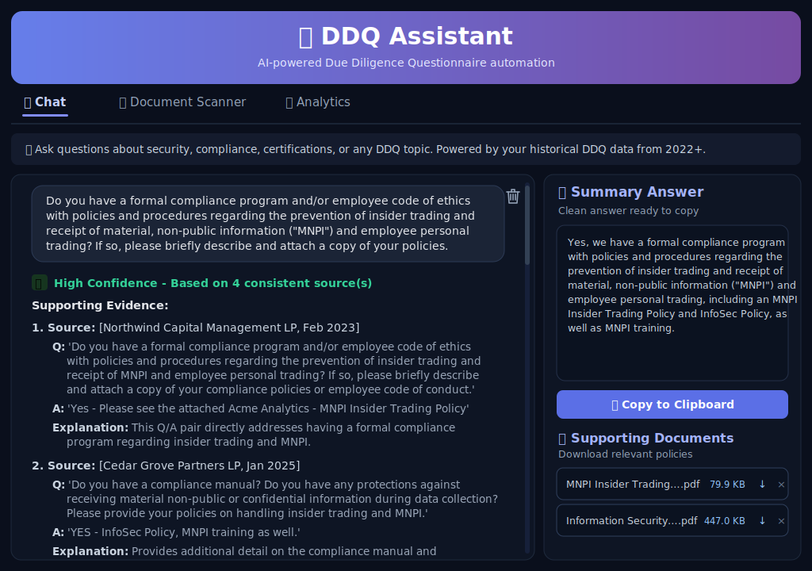
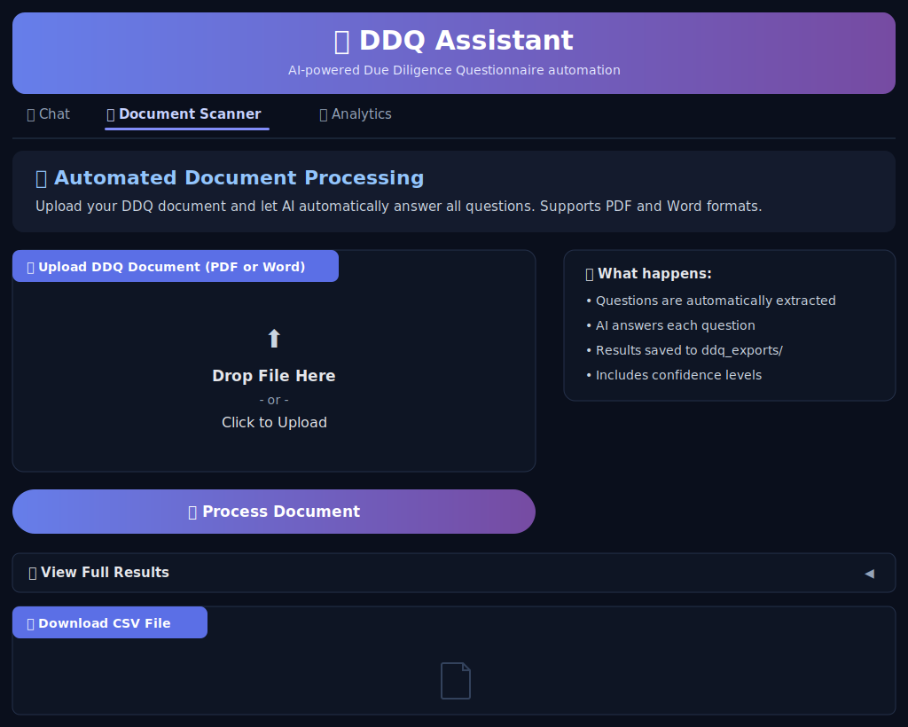
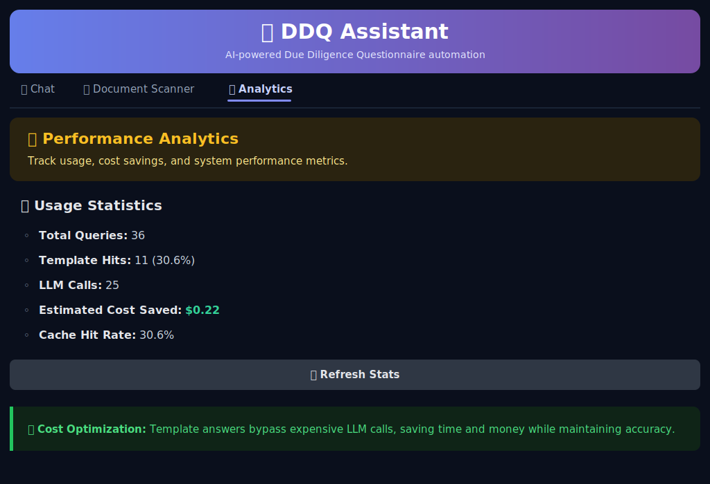

# DDQ RAG Assistant

An AI assistant that turns a company's history of **Due Diligence Questionnaires
(DDQs)** and security questionnaires into an instant, searchable answer engine.

Responding to investor and customer DDQs is repetitive, high-stakes work: the same
questions about security, privacy, compliance, and corporate structure come back
again and again, slightly reworded each time. This project ingests every past
answered questionnaire into a knowledge base, then uses Retrieval-Augmented
Generation (RAG) to synthesize accurate, copy-ready answers, with sources and a
confidence level, so a human can review and submit in seconds instead of hours.

> **Note on data:** This repository ships with a fully **synthetic** sample
> knowledge base (`data/sample_ddq_knowledge_base.csv`) for a fictional company,
> *Acme Analytics, Inc.* No real company data, credentials, or client documents
> are included. Point the app at your own data by editing `.env`.

---

## What it does

- **Chat (primary)** &mdash; Ask in plain language and get a synthesized answer from
  your past responses, with cited sources, freshness, and a confidence score, plus
  a clean, copy-ready Summary Answer. Relevant policies (InfoSec, SOC 2, MNPI,
  HIPAA…) are auto-attached as downloadable links.
- **Document Scanner (best-effort)** &mdash; Upload a blank DDQ to auto-extract and
  answer its questions into a CSV. A useful first pass; extraction quality depends
  on the document's structure, so refine the output in Chat.
- **Analytics** &mdash; Template-cache hit-rate and estimated cost saved (modest,
  mainly to make the caching visible).

## Smart features

Small touches in the Chat tab that make it fast to use day to day:

- **Auto spell-check** &mdash; fixes common questionnaire typos before retrieval.
- **Company-name normalization** &mdash; collapses name/domain variants to one
  canonical form so phrasing differences don't hurt recall.
- **Source-freshness tracking** &mdash; flags how old each cited answer is.
- **Template answers** &mdash; serves repeat questions from cache, skipping the LLM.
- **One-click clear** &mdash; a trash icon in the top-right of the chat box instantly
  resets the conversation.

## Screenshots

> These are SVG mockups of the actual dark-themed UI (not live captures).
> Replace them with screenshots of your running app when convenient (see
> [`assets/README.md`](assets/README.md)).

**Chat** &mdash; ask a question and get a structured answer. The chat box
**auto-scrolls** (animated SVG) through a confidence banner and numbered
**Supporting Evidence** (each with its source, original Q/A, and why it's
relevant), down to the clean copy-ready **Summary Answer**. In the example, an
insider-trading / MNPI question auto-attaches the matching policies (**Insider
Trading Policy** and **Information Security Policy**) as downloadable links in the
Supporting Documents panel.



**Document Scanner** &mdash; upload a blank DDQ to auto-extract and answer its
questions, then export to CSV. A best-effort helper: extraction depends on the
document's structure, so it's a draft-generator rather than the main workflow.



**Analytics** &mdash; track query volume, template cache hit-rate, and estimated
LLM cost saved (modest, but it makes the caching visible).



## How it works

```
                ┌──────────────────────────┐
                │  Historical DDQ answers  │
                │  (CSV knowledge base)    │
                └────────────┬─────────────┘
                             │  embed (MiniLM)
                             ▼
   question ─▶ preprocess ─▶ FAISS vector search ─▶ top-k Q/A pairs
                  │                                      │
         template cache hit?                       build context
                  │ yes                                  │
                  ▼                                      ▼
            instant answer                 LLM (AWS Bedrock, Llama 3.3 70B)
                                                         │
                                                         ▼
                                       structured answer + summary + confidence
```

1. **Preprocessing** normalizes company-name variants, fixes common misspellings,
   and expands acronyms (SOC 2, HIPAA, GDPR, ...) to improve retrieval recall.
2. **Template cache** serves high-confidence repeat questions directly from the
   knowledge base, skipping the LLM entirely to save cost and latency.
3. **Retrieval** embeds questions with `all-MiniLM-L6-v2` and searches a FAISS
   index for the most relevant past Q/A pairs.
4. **Generation** feeds the retrieved context to an LLM with a strict prompt that
   forbids speculation and produces a submission-ready summary plus supporting
   evidence with sources.
5. **Post-processing** keeps time-sensitive answers (e.g. "years in business")
   current and strips formatting for the copy-ready box.

## Tech stack

| Area | Choice |
| --- | --- |
| Language | Python 3.10+ |
| UI | Gradio |
| RAG framework | LangChain |
| Embeddings | Sentence-Transformers (`all-MiniLM-L6-v2`) |
| Vector store | FAISS |
| LLM | AWS Bedrock (Meta Llama 3.3 70B Instruct), configurable |
| Document parsing | pdfplumber, python-docx |

## Project structure

```
ddq-rag-assistant/
├── app.py                  # Main Gradio app (Chat / Scanner / Analytics)
├── config.py               # Central, env-driven configuration
├── rag_enhancements.py     # Query preprocessing, template cache, freshness, dedup
├── answer_cleaner.py       # Cleans LLM output for export & copy-ready summaries
├── ddq_scanner.py          # Extracts questions from PDF/Word DDQs
├── pdf_text_extractor.py   # Lightweight PDF/DOCX text extraction
├── bulk_pdf_import.py       # Bulk-import Q&A from existing DDQ PDFs
├── data/
│   └── sample_ddq_knowledge_base.csv   # Synthetic sample data
├── ddq_exports/            # Generated answer CSVs (gitignored)
├── policies/               # Drop your own policy PDFs here (gitignored)
├── docs/
│   ├── ARCHITECTURE.md
│   └── BUSINESS_IMPACT.md
├── assets/                 # Screenshots for this README
├── .env.example
├── requirements.txt
└── LICENSE
```

## Getting started

### 1. Prerequisites
- Python 3.10 or newer
- An AWS account with access to Amazon Bedrock and a chat-capable model
  (the default is Meta Llama 3.3 70B Instruct)

### 2. Install

```bash
git clone https://github.com/<your-username>/ddq-rag-assistant.git
cd ddq-rag-assistant
python -m venv .venv
# Windows:
.venv\Scripts\activate
# macOS/Linux:
source .venv/bin/activate

pip install -r requirements.txt
```

### 3. Configure

```bash
cp .env.example .env   # Windows: copy .env.example .env
```

Edit `.env` and set, at minimum, your AWS credentials. You can also customize the
company name, founding year, model id, and file paths there.

### 4. Run

```bash
python app.py
```

Open the URL printed in the terminal (default: `http://127.0.0.1:7860`).

## Deployment

The app is just a single `python app.py` process, so there are two natural ways
to run it:

**On demand (local).** Run it on your own machine whenever you need to work
through a questionnaire. With the default `SERVER_NAME=127.0.0.1` it's reachable
only from your computer at `http://127.0.0.1:7860`; stop it when you're done.

**Always-on (cloud VM / AWS EC2).** This is how I run it at work. Put the project
on an EC2 instance, set `SERVER_NAME=0.0.0.0` in `.env`, and start `app.py` under
a process manager so it keeps running in the background. As long as the instance
stays running, the assistant is online at the instance's address
(`http://<instance-ip-or-dns>:7860`) and the team can open it anytime, no one has
to re-launch it. When the instance is stopped, the app simply goes offline.

Keeping the process up (pick one):

```bash
# quick and simple
nohup python app.py > ddq.log 2>&1 &

# or a detached tmux session that survives logout
tmux new -s ddq 'python app.py'
```

For a durable setup, run it as a `systemd` service so it restarts on reboot or
crash. Then open the chosen port (default `7860`) in the instance's security
group.

> **Security:** binding to `0.0.0.0` exposes the app on the network, and it has
> **no built-in authentication**. Before exposing it, restrict the EC2 security
> group to your company IP range or VPN, and/or put it behind a reverse proxy
> (nginx / ALB) with TLS, and/or enable Gradio auth, e.g.
> `demo.launch(..., auth=("user", "pass"))`. For a quick throwaway demo without a
> server, `demo.launch(share=True)` creates a temporary public Gradio link, but
> that's not intended for sensitive, always-on use.

## Using your own data

Replace the sample file or point `KNOWLEDGE_BASE_PATH` at your own CSV. The
expected columns are:

| Column | Description |
| --- | --- |
| *(first column)* | Optional row id (e.g. `Q001`) |
| `Question` | The historical question text |
| `Response` | Your firm's answer |
| `Source` | Attribution as `Requester Name, Mon YYYY` (powers freshness tracking) |

To attach supporting policy documents in the Chat tab, drop PDFs into `policies/`
using the filenames listed in [`policies/README.md`](policies/README.md).

## Security & privacy

- Credentials are read from environment variables; `.env` is gitignored.
- Real knowledge-base data, generated exports, and policy PDFs are gitignored by
  default so confidential material is never committed.
- The LLM prompt is constrained to answer **only** from retrieved context and to
  avoid fabricating information.
- The app binds to `127.0.0.1` by default. Add authentication and restrict
  network access before exposing it (see [Deployment](#deployment)).

## Project evolution

The repo ships the third of three working iterations (a fourth is specced but not
built).

| Version | Focus | Key additions | Still missing |
| --- | --- | --- | --- |
| **v0** | Local proof of concept | FAISS + MiniLM retrieval over the CSV; local Ollama model; bare `ask()` with a simple cite/quote/explain prompt | UI, confidence, document handling |
| **v1** | Chat UI + cloud model | Gradio chat; AWS Bedrock (Llama 3.3 70B); the strict **Supporting Evidence + Summary Answer** prompt; batch CLI | confidence, caching, query cleanup, freshness, copy box, scanner, analytics |
| **v2** *(this repo)* | Production assistant | Query preprocessing (spell/alias/acronym), template cache, confidence + freshness, copy-ready summary, auto-attached docs, Document Scanner, bulk import + dedup, streaming UI, Analytics | — |
| **v3** | Enterprise hardening *(designed, not built)* | Auth, analytics DB, REST API, feedback loop, response caching — see [Roadmap](#roadmap--possible-enhancements) | not implemented |

## Roadmap & possible enhancements

Near-term, low-effort:
- Persist the FAISS index instead of rebuilding it on every startup.
- Wire the existing `SemanticDeduplicator` (in `rag_enhancements.py`) into the
  import flow.
- Add or swap LLM providers via LangChain (see
  [Swapping the LLM provider](#swapping-the-llm-provider)).

Planned "v3" (specified but **not yet built**):
- Multi-user **authentication** with roles (bcrypt, sessions, account lockout).
- A persistent **analytics database** with real ROI / time-savings reporting.
- A **REST API** (FastAPI) with token auth and rate limiting for CRM integration.
- A **feedback loop** (thumbs up/down + corrections feeding the knowledge base).
- Similarity-based **response caching** with TTL, plus health checks, retries,
  and alerting.

These reflect a design spec, not implemented features.

## Swapping the LLM provider

This project uses **AWS Bedrock** (Meta Llama 3.3 70B Instruct) by default. Because
generation goes through LangChain, the provider is isolated to a single object in
`app.py`:

```python
aws_model = ChatBedrockConverse(
    model=config.BEDROCK_MODEL_ID,
    aws_access_key_id=os.getenv("AWS_ACCESS_KEY_ID"),
    aws_secret_access_key=os.getenv("AWS_SECRET_ACCESS_KEY"),
    temperature=config.LLM_TEMPERATURE,
    region_name=config.AWS_REGION,
)
```

To use a different model, swap that object for any LangChain chat model and keep
the rest of the chain (`prompt | model | StrOutputParser`) unchanged. For example:

- **Other Bedrock models** &mdash; change `BEDROCK_MODEL_ID` in `.env` (e.g. an
  Anthropic Claude or Amazon Nova model your account has access to).
- **OpenAI** &mdash; `pip install langchain-openai`, then
  `from langchain_openai import ChatOpenAI; model = ChatOpenAI(model="gpt-4o-mini")`.
- **Anthropic API** &mdash; `pip install langchain-anthropic`, then
  `from langchain_anthropic import ChatAnthropic`.
- **Local models** &mdash; use `langchain-ollama` to run an open model on your machine.

The embeddings/retrieval layer is independent of the LLM choice, so swapping
providers does not require re-indexing.

## License

MIT — see [LICENSE](LICENSE).
